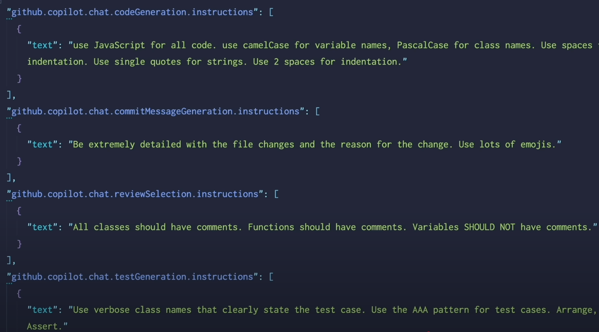
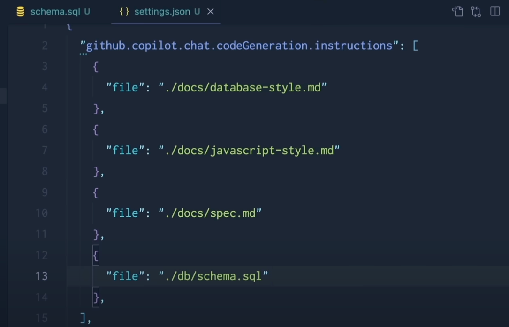

# Github copilot

## Instructions

Earlier as a developer we used to follow some patterns, conventions, format, guidelines etc which the developers used to follow while writing code. Sometimes these were documented in the form of wiki pages, markdown files or some other format. Scary part was sometimes they were not documented at all and were either missed or passed on as review comments during the pull request review.

With the advent of AI tools like Github Copilot, ChatGPT, Bard etc, we can now leverage these tools to follow these patterns, conventions, format, guidelines etc while writing code. This not only helps in maintaining consistency across the codebase but also helps in reducing the time taken to write code.

You can now document these instruction not only for the new contributors but also provide additional context to the prompt by enriching it with the instructions. This will help the AI tools to generate code, provide appropriate review feedbacks that is more aligned with the expectations of the team.

Instructions can be added in the following ways

- [Add personal instructions](https://docs.github.com/en/copilot/how-tos/configure-custom-instructions/add-personal-instructions)
- [Add repository instructions](https://docs.github.com/en/copilot/how-tos/configure-custom-instructions/add-repository-instructions)
- [Add organization instructions](https://docs.github.com/en/copilot/how-tos/configure-custom-instructions/add-organization-instructions)

### Custom Instructions for repository

You can add custom instructions for your repository by adding a file named `.github/copilot-instructions.md` in the root of your repository. This file should contain the instructions that you want to provide to the AI tool.

With tools like VS code you should be able to add these instructions in the settings as well. Here is an example of how to add custom instructions for commit message generation, test, review, and git, with descriptions and examples:

You can also associate this with file types as well.

### When can I use it?

- Commit message generation
- Test generation
- Code review
- Adhering to the standards and conventions of the team
- Refactoring to new instructions
- etc..

### Examples

- [Github > devs-from-matrix/template-hexagonal-spring-boot-java](https://github.com/devs-from-matrix/template-hexagonal-spring-boot-java/blob/main/.github/copilot-instructions.md)
- [Github > Code-and-Sorts \ awesome-copilot-instructions](https://github.com/code-and-sorts/awesome-copilot-instructions)

### References

- [Smaller prompts, better answers with GitHub Copilot Custom Instructions](https://www.youtube.com/watch?v=zwIlqbTHjac)

