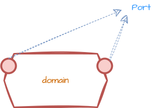
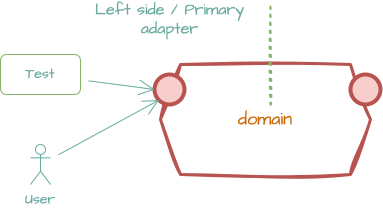
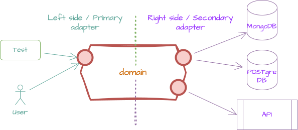

# Hexagonal architecture

## Introduction

The first time I encountered and got inspired by the hexagonal architecture was when I saw a series (3 in total) of YouTube video by [Alistair COCKBURN](https://en.wikipedia.org/wiki/Alistair_Cockburn) and [Thomas PIERRAIN](https://github.com/tpierrain). Alistair was talking about the ports and adapters pattern, which is another name for the hexagonal architecture. I was amazed by the simplicity and the power of this architecture. It was a real eye-opener for me. I have been using this architecture ever since.

<h4>Ports are nothing but interface\contracts and adapters are the ones that implement these interfaces. The core of the application is the domain and the domain should not know anything about the outside world. The domain should be pure and should not have any dependencies on the outside world. The domain should be the center of the application and everything else should be connected to the domain.
</h4>

## Where could I use and where I should NOT use ?

I personally found this architecture very useful in the following scenarios:

- When you want to have a clean separation between the domain and the outside\infrastructure world.
- When the infrastructure is changing frequently.
- When you have several infrastructures that you want to support for the same domain.
- When you want to make your application more maintainable and adaptable to changes

The hexagonal architecture should NOT be used when:

- For small, simple applications where the overhead of setting up the architecture outweighs the benefits.
- When the application has very few dependencies and is unlikely to change or grow significantly.
- In projects with tight deadlines where the initial complexity of setting up hexagonal architecture could delay delivery.
- When the team is not familiar with the architecture and there is insufficient time for learning and adaptation.
- For applications where performance is critical and the additional abstraction layers could introduce unacceptable latency.

## Key definitions

### Domain

<figure markdown="1">

</figure>

The domain is the core of the application. It contains the business logic and the entities that represent the business concepts. The domain should be pure and should not have any dependencies on the outside world. The domain should be the center of the application and everything else should be connected to the domain.

### Ports

<figure markdown="1">

</figure>

Ports are interfaces that define the contract between the domain and the outside world. Think of it a door that allows external world to interact with the domain. The domain should define the ports and the outside world should implement these ports in order to interact with the domain.

### Adapters

#### Left-side adapters a.k.a primary adapters

> The guy who kicks the domain.

<figure markdown="1">

</figure>

Left-side adapters are the ones that implement the ports defined by the domain. These adapters are responsible for translating the external world's requests into domain-specific commands and queries. They are also responsible for translating the domain's responses into a format that the external world can understand.

#### Right-side adapters a.k.a secondary adapters

> The guy who is being kicked by the domain.

<figure markdown="1">

</figure>

Right-side adapters are the ones that the domain uses to interact with the outside world. These adapters are responsible for translating the domain's commands and queries into a format that the external world can understand. They are also responsible for translating the external world's responses into a format that the domain can understand.

## Illustrations

These are some of the illustrations that Alastair used in the YouTube videos to explain the hexagonal architecture and those illustrations are very helpful to understand the architecture.

## References

- [Alistair in the "Hexagone" 1/3](https://www.youtube.com/watch?v=th4AgBcrEHA)
- [Alistair in the "Hexagone" 2/3](https://www.youtube.com/watch?v=iALcE8BPs94)
- [Alistair in the "Hexagone" 3/3](https://www.youtube.com/watch?v=DAe0Bmcyt-4)