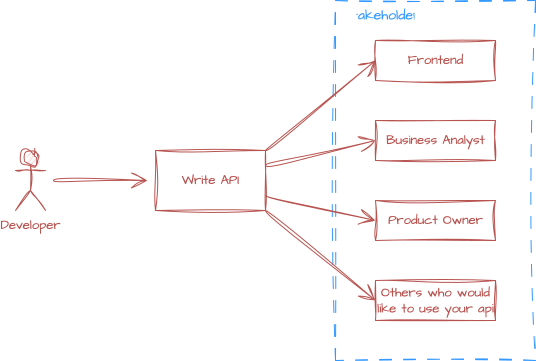
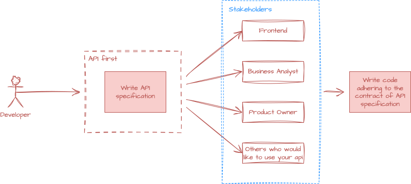
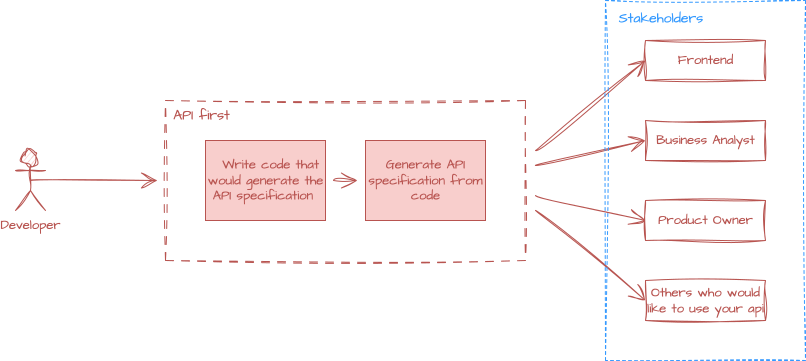

# API First

The API-first approach is a development methodology where APIs are designed, documented, and agreed upon before any usage or user interface development begins. This ensures that APIs are treated as first-class products and serve as the foundation for system integration and communication. The popular approaches to achieving this are [design-first](#design-first) and [code-first](#code-first).


{: .mx-auto .d-block}

## Design first

This is the most common and structured form of API first. In this approach, the API is designed and documented before any code is written. The design is often done collaboratively with stakeholders, including developers, product owners, and business analysts. The API specification serves as a contract that guides the development process.

{: .mx-auto .d-block}

### How to do it?

#### Write API Specification

You start with the design specification by writing API specification file

??? info "Example Open API Specification"

    The following is an example of an Open API specification for a simple API that manages examples. It defines endpoints to get all examples and to get an example by its code.

    ```yaml title="open-api.yaml"
    ---
    openapi: 3.0.1
    info:
      title: Example API Documentation
      version: v1
    tags:
      - name: Example
        description: Resource to manage example
    paths:
      "/api/v1/examples":
        get:
          tags:
            - Example
          summary: Get all examples
          operationId: getExamples
          responses:
            '200':
              description: OK
              content:
                "*/*":
                  schema:
                    "$ref": "#/components/schemas/ExampleInfo"
      "/api/v1/examples/{code}":
        get:
          tags:
            - Example
          summary: Get example by code
          operationId: getExampleByCode
          parameters:
            - name: code
              in: path
              required: true
              schema:
                type: integer
                format: int64
          responses:
            '200':
              description: OK
              content:
                "*/*":
                  schema:
                    "$ref": "#/components/schemas/Example"
    components:
      schemas:
        Example:
          type: object
          properties:
            code:
              type: integer
              format: int64
            description:
              type: string
        ExampleInfo:
          type: object
          properties:
            examples:
              type: array
              items:
                "$ref": "#/components/schemas/Example"
        ProblemDetail:
          type: object
          properties:
            type:
              type: string
            title:
              type: string
            status:
              type: integer
              format: int32
            detail:
              type: string
            instance:
              type: string
            timestamp:
              type: string
              format: date-time
    ```

#### Write Code

With the above Open API specification, you can now generate server stubs and client SDKs using tools like Swagger Codegen or OpenAPI Generator. This allows you to focus on implementing the business logic without worrying about the API contract. 

As an example, I would like to showcase how to generate the code for a Spring Boot application using OpenAPI Generator with the maven `openapi-generator-maven-plugin`.

??? info "Example usage of OpenAPI Generator Maven Plugin"

    The following is an example of how to configure the `openapi-generator-maven-plugin` in your `pom.xml` file to generate the API and model classes based on the Open API specification.

    ```xml title="pom.xml"
    <plugin>
      <groupId>org.openapitools</groupId>
      <artifactId>openapi-generator-maven-plugin</artifactId>
      <version>7.14.0</version>
      <executions>
        <execution>
          <id>generate-open-api-source</id>
          <goals>
            <goal>generate</goal>
          </goals>
          <configuration>
            <inputSpec>${project.basedir}/src/main/resources/open-api.yaml</inputSpec>
            <generatorName>spring</generatorName>
            <library>spring-boot</library>
            <schemaMappings>
              <schemaMapping>Example=packagename.domain.model.Example</schemaMapping>
            </schemaMappings>
            <typeMappings>
              <typeMapping>OffsetDateTime=java.time.LocalDateTime</typeMapping>
            </typeMappings>
            <apiPackage>packagename.rest.generated.api</apiPackage>
            <modelPackage>packagename.rest.generated.model</modelPackage>
            <configOptions>
              <useBeanValidation>false</useBeanValidation>
              <performBeanValidation>false</performBeanValidation>
              <useSpringBoot3>true</useSpringBoot3>
              <interfaceOnly>true</interfaceOnly>
              <dateLibrary>java8</dateLibrary>
              <useTags>true</useTags>
              <openApiNullable>false</openApiNullable>
              <additionalModelTypeAnnotations>@lombok.AllArgsConstructor @lombok.Builder @lombok.Data @lombok.NoArgsConstructor
              </additionalModelTypeAnnotations>
            </configOptions>
          </configuration>
        </execution>
      </executions>
    </plugin>
    ```

The above plugin with configuration will generate the contract in `target/generated-sources/openapi/src/main/java/packagename/rest/generated` for the api and the model classes. You can then implement the business logic in the generated interfaces.

??? info "Example code to implement the generated contracts"

    The following is an example of how to implement the generated API interface in a Spring Boot application. The `ExampleResource` class implements the `ExampleApi` interface and provides the business logic for the endpoints defined in the Open API specification.

    ```java title="ExampleResource.java"
    package packagename.rest;
    
    import org.springframework.http.ResponseEntity;
    import org.springframework.web.bind.annotation.PathVariable;
    import org.springframework.web.bind.annotation.RestController;
    import packagename.domain.model.Example;
    import packagename.domain.port.RequestExample;
    import packagename.rest.generated.api.ExampleApi;
    import packagename.rest.generated.model.ExampleInfo;
    
    @RestController
    public class ExampleResource implements ExampleApi {
    
      private final RequestExample requestExample;
    
      public ExampleResource(RequestExample requestExample) {
        this.requestExample = requestExample;
      }
    
      public ResponseEntity<ExampleInfo> getExamples() {
        return ResponseEntity.ok(ExampleInfo.builder().examples(requestExample.getExamples()).build());
      }
    
      public ResponseEntity<Example> getExampleByCode(@PathVariable("code") Long code) {
        return ResponseEntity.ok(requestExample.getExampleByCode(code));
      }
    }
    ```

### Pros & Cons

| Pros                                                                    | Cons                                                                |
|-------------------------------------------------------------------------|---------------------------------------------------------------------|
| Feedback is much faster as you only need specification file             | May slow initial development for small projects                     |
| Encourages better collaboration(especially with frontend/backend teams) | Initial learning curve for tools\spec                               |
| Enabled contract driven development and parallel team works             | Will have ripple effect\rework if business requirements are unclear |
| Promotes clear API contracts and reduces ambiguity                      | Sometimes leads to over-engineering                                 |

## Code first

In this approach, the development team relies on their expertise & skill to write the code and derive the API specification out of it. This is often faster for experienced developers but can lead to inconsistencies and lack of documentation.

{: .mx-auto .d-block}


### How to do it?

#### Write Code

You start with writing the code for your API. This can be done using any programming language or framework of your choice. 

??? info "Example code"

    The following is an example of a simple Spring Boot application that provides an API to manage examples. It defines two endpoints: one to get all examples and another to get an example by its code.

    ```java title="ExampleResource.java"
    package packagename.rest;
    
    import io.swagger.v3.oas.annotations.Operation;
    import io.swagger.v3.oas.annotations.Parameter;
    import io.swagger.v3.oas.annotations.responses.ApiResponse;
    import io.swagger.v3.oas.annotations.media.Content;
    import io.swagger.v3.oas.annotations.media.Schema;
    import org.springframework.http.ResponseEntity;
    import org.springframework.web.bind.annotation.PathVariable;
    import org.springframework.web.bind.annotation.RestController;
    import packagename.domain.model.Example;
    import packagename.domain.port.RequestExample;
    import packagename.rest.generated.model.ExampleInfo;
    
    @RestController
    public class ExampleResource {
    
      private final RequestExample requestExample;
    
      public ExampleResource(RequestExample requestExample) {
        this.requestExample = requestExample;
      }
    
      @Operation(
          summary = "Get all examples",
          responses = {
              @ApiResponse(
                  responseCode = "200",
                  description = "OK",
                  content = @Content(schema = @Schema(implementation = ExampleInfo.class))
              )
          }
      )
      public ResponseEntity<ExampleInfo> getExamples() {
        return ResponseEntity.ok(ExampleInfo.builder().examples(requestExample.getExamples()).build());
      }
    
      @Operation(
          summary = "Get example by code",
          parameters = {
              @Parameter(name = "code", description = "Example code", required = true)
          },
          responses = {
              @ApiResponse(
                  responseCode = "200",
                  description = "OK",
                  content = @Content(schema = @Schema(implementation = Example.class))
              )
          }
      )
      public ResponseEntity<Example> getExampleByCode(@PathVariable("code") Long code) {
        return ResponseEntity.ok(requestExample.getExampleByCode(code));
      }
    }
    ```

#### Generate API Specification

Once the code is written, you can generate the API specification using tools like Swagger or Springfox. These tools can scan your code annotations and generate an OpenAPI specification file.

??? info "Example usage of Springfox to generate OpenAPI specification"

    The following is an example of how to configure Springfox in your `pom.xml` file to generate the OpenAPI specification from your code annotations.

    ```xml title="pom.xml"
    <dependency>
      <groupId>io.springfox</groupId>
      <artifactId>springfox-boot-starter</artifactId>
      <version>3.0.0</version>
    </dependency>
    ```

    You can then access the generated OpenAPI specification at `/v3/api-docs` endpoint in your application.

### Pros & Cons

| Pros                                                       | Cons                                                                                 |
|------------------------------------------------------------|--------------------------------------------------------------------------------------|
| Fast to get started, especially for backend-heavy projects | Verbosity in code increased as you couple specification code too with business logic |
| Familiar developer experience (code-centric mindset)       | Harder for external teams to understand or mock APIs without docs                    |
| More dynamic and flexible in early prototyping             | APIs can become inconsistent without a unified contract                              |
| Easier to evolve with agile practices                      | Testing and client generation become harder without standardized spec                |

## When to Use Each Approach

| Scenario                                                      | Recommended Approach         | Rationale                                                     |
|---------------------------------------------------------------|------------------------------|---------------------------------------------------------------|
| Large, distributed teams (frontend, backend, QA)              | Design-First                 | Enables contract-first collaboration and parallel development |
| Public-facing APIs                                            | Design-First                 | Requires detailed documentation and stable contracts          |
| Regulatory/compliance-driven APIs (e.g., healthcare, finance) | Design-First                 | Provides traceability and strict interface control            |
| Small, backend-heavy internal tools                           | Code-First                   | Faster to build with minimal overhead                         |
| Rapid prototyping or proof-of-concept                         | Code-First                   | Allows quick iteration and flexibility                        |
| Strong DevOps and CI/CD practices already in place            | Either, with good discipline | Depends on team preference and automation maturity            |

