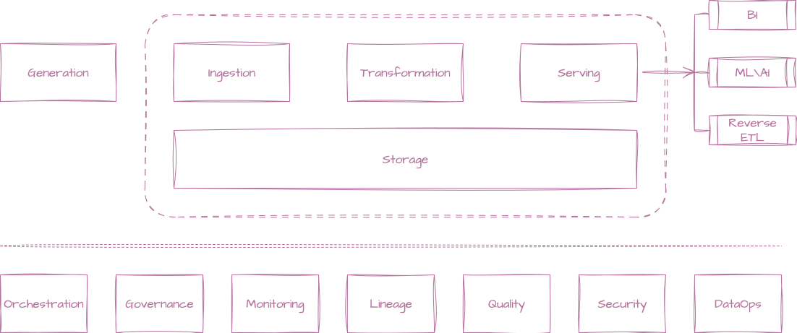
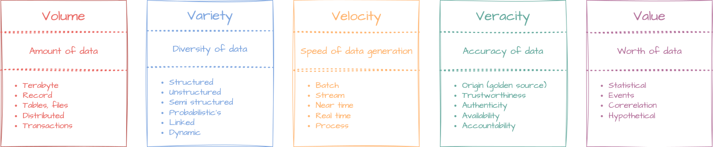

# Introduction to Data

In today's digital landscape, data plays a crucial role in driving business decisions, enhancing
customer experiences, and optimizing operations. It encompasses a wide range of information
collected from various sources, including customer interactions, transactions, social media, and IoT
devices. The ability to effectively manage and analyze this data is essential for organizations to
remain competitive and innovative.

## Data engineering

Data engineering is the discipline focused on designing, building, and maintaining the systems and
infrastructure that enable the collection, storage, and processing of data. It involves creating
data pipelines, ensuring data quality, and making data accessible for analysis. Data engineers work
with various technologies such as databases, data warehouses, data lake, data lake house, and big
data frameworks to ensure that data flows seamlessly through an organization.

### Data pipelines

Data pipelines are automated workflows that move data from one system to another, transforming it
along the way. They are essential for ensuring that data is collected, processed, and made available
for analysis in a timely manner. Data engineers design and implement these pipelines to handle large
volumes of data efficiently, ensuring data integrity and consistency.

- **Generation**: The systems or applications that generate data, such as web applications, IoT
  devices, and sensors.
- **Ingestion**: The process of collecting data from various sources, such as databases, APIs,
  and files, and bringing it into the data pipeline.
- **Transformation**: The process of cleaning, enriching, and transforming raw data into a
  format suitable for analysis. This may involve filtering, aggregating, or joining data from
  different sources.
- **Serving**: The process of making transformed data available for analysis and
  reporting. This may involve loading data into a data warehouse, data lake, or other storage
  solutions.
- **Storage**: The process of storing transformed data in a database, data warehouse,
  or data lake, where it can be accessed for analysis. Data engineers choose the appropriate storage
  solution based on the volume, variety, and velocity of the data.
- **Orchestration**: The process of managing and scheduling the execution of data pipeline
  tasks. This ensures that data flows smoothly through the pipeline and that dependencies between
  tasks are handled correctly. Tools like Apache Airflow and Luigi are commonly used for data
  orchestration.
- **Governance**: The process of ensuring that data is managed according to organizational
  policies and standards. This includes data security, privacy, and compliance with regulations.
  Data engineers work closely with data governance teams to implement best practices for data
  management.
- **Data monitoring**: The process of tracking the performance and health of data pipelines.
  This includes monitoring for errors, latency, and data quality issues. Data engineers implement
  monitoring solutions to ensure that data pipelines run smoothly and efficiently.
- **Data lineage**: The process of tracking the origin and transformations of data as it moves
  through the pipeline. This helps organizations understand the flow of data, identify potential
  issues, and ensure data quality. Data lineage tools provide visibility into how data is created,
  transformed, and consumed within the organization.
- **Data quality**: The process of ensuring that data is accurate, complete, and consistent.
  Data engineers implement data validation and cleansing processes to maintain high data quality
  standards. This includes identifying and resolving data anomalies, duplicates, and
  inconsistencies.
- **Data security**: The process of protecting data from unauthorized access, breaches, and
  loss. Data engineers implement security measures such as encryption, access controls, and
  monitoring to safeguard sensitive data. This is especially important in industries with strict
  regulatory requirements.
- **DataOperations (DataOps)**: DataOps is an agile approach to data management that emphasizes
  collaboration, automation, and continuous improvement. It aims to streamline data workflows,
  reduce time-to-insight, and enhance data quality. Data engineers play a key role in implementing
  DataOps practices by automating data pipelines, monitoring data quality, and fostering collaboration
  between data teams.

## Data science

Data science is the field that combines statistical analysis, machine learning, and domain expertise
to extract insights and knowledge from data. Data scientists analyze complex datasets to identify
patterns, make predictions, and inform decision-making. They use programming languages like Python
and R, along with tools like Jupyter Notebooks and TensorFlow, to build models that can solve
real-world problems.

## Data analytics

Data analytics involves examining datasets to draw conclusions and make informed decisions. It
encompasses various techniques, including

- Descriptive analytics (summarizing past data)
- Diagnostic analytics (understanding why something happened)
- Predictive analytics (forecasting future trends)
- Prescriptive analytics (recommending actions)
  Data analysts use tools like SQL, Excel, and visualization software to interpret data and
  communicate findings effectively.

## Big data

Big data refers to extremely large and complex datasets that traditional data processing tools
cannot handle efficiently. It is characterized by the "five V's": volume, variety, velocity,
veracity, and value. Big data technologies, such as Hadoop and Spark, enable organizations to store,
process, and analyze vast amounts of data in real-time, unlocking new opportunities for innovation
and growth.

### Volume

Volume refers to the sheer amount of data generated every second, from various sources like social
media, sensors, and transactions. Organizations must have the infrastructure to store and manage
this data effectively.

### Variety

Variety refers to the different types of data, including structured, semi-structured, and
unstructured data. Organizations must be able to handle diverse data formats and sources to gain
comprehensive insights.

### Velocity

Velocity is the speed at which data is generated and processed. Real-time data processing allows
organizations to respond quickly to changing conditions and make timely decisions.

### Veracity

Veracity is the quality and reliability of data. Ensuring data accuracy and consistency is crucial
for making informed decisions. Organizations must implement data validation and cleansing processes
to maintain high data quality.

### Value

Value is the ultimate goal of data analysis. Organizations must extract meaningful insights from
data to drive business value and create competitive advantages. This involves identifying key
performance indicators (KPIs) and aligning data initiatives with business objectives.

## Data governance

Data governance is the framework that ensures data is managed effectively and responsibly within an
organization. It involves establishing policies, standards, and procedures for data management,
including data quality, security, privacy, and compliance. Effective data governance helps
organizations maintain trust in their data, ensure regulatory compliance, and support data-driven
decision-making.

## Data visualization

Data visualization is the graphical representation of data and information. It helps to communicate
complex data insights in a clear and intuitive manner, making it easier for stakeholders to
understand trends, patterns, and anomalies. Tools like Tableau, Power BI, and D3.js are commonly
used to create interactive dashboards and visualizations that facilitate data exploration and
storytelling.

## Data ethics

Data ethics refers to the moral principles and guidelines that govern the collection, use, and
sharing of data. It addresses issues such as privacy, consent, bias, and transparency in data
practices. Organizations must prioritize ethical considerations to build trust with customers and
stakeholders while ensuring that data is used responsibly and for the greater good.

## Conclusion

Data is a valuable asset that drives innovation and growth in today's digital world. By
understanding the various aspects of data, including data engineering, data science, data analytics,
big data, data governance, data visualization, and data ethics, organizations can harness the power
of data to make informed decisions and create meaningful impact. Embracing a data-driven culture is
essential for staying competitive and meeting the evolving needs of customers and markets.
