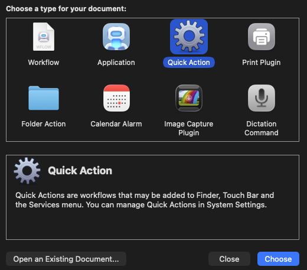
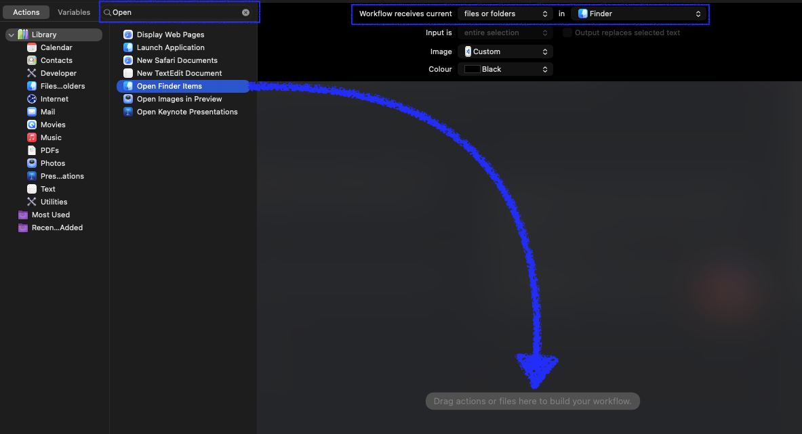
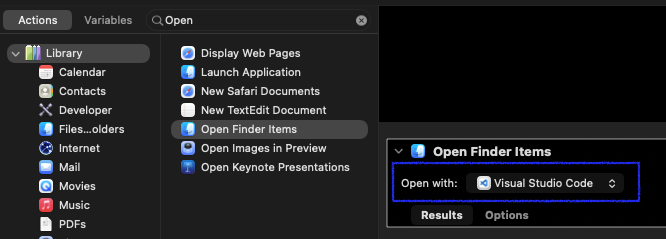

# Quick Actions - Add VSCode or IntelliJ

You might often want to open VSCode or IntelliJ from a folder in Finder. Here we showcase the easier way to do that with **Quick Actions**.

## What are Quick Actions?

Quick Actions are custom automations you can add to the macOS Finder's right-click context menu via **Automator**. Once set up, you can right-click any folder in Finder and open it directly in your preferred editor.

---

## Open a Folder in VSCode or IntelliJ

### Step 1 – Open Automator

1. Press `Cmd + Space` to open Spotlight.
2. Type **Automator** and press `Enter`.

### Step 2 – Create a New Quick Action

1. Click **New Document**.
2. Select **Quick Action** and click **Choose**.

<figure markdown="1">

</figure>

### Step 3 – Configure the Workflow

1. At the top, search for **Open Finder Items**.
2. Drag and drop it onto **Drag actions or files here to build your workflow**.
3. Set **Workflow receives current** → **"Files or folders"** and **in** → **"Finder"**.

<figure markdown="1">

</figure>

### Step 4 – Configure Open Finder Items

In **Open With** → choose from Applications → **"Visual Studio Code"** or **"IntelliJ"**.

<figure markdown="1">

</figure>

### Step 5 – Save the Quick Action

1. Press `Cmd + S`.
2. Name it **Open in VSCode** or **Open in IntelliJ**.

### Step 6 – Use It

1. Open **Finder** and navigate to any folder.
2. Right-click the folder.
3. Select **Quick Actions** → **Open in VSCode** or **Open in IntelliJ**.

!!!tip

    If you don't see Quick Actions in the context menu, go to **System Settings → Privacy & Security → Extensions → Finder Extensions** and make sure **Automator** actions are enabled.