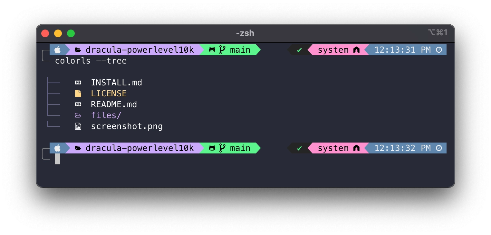

# Beautify terminal

Here I are planning to add some tips and tricks to beautify your terminal.



## Installing `oh my zsh`

Oh My Zsh is an open source, community-driven framework for managing your Zsh configuration.

```bash
sh -c "$(curl -fsSL https://raw.githubusercontent.com/ohmyzsh/ohmyzsh/master/tools/install.sh)"
```

??? info "Read more"
    More about om-myzsh can be found [here](https://ohmyz.sh/).

## Installing Powerlevel10k

In order for the terminal to look like the one in the image above, you need to install Powerlevel10k theme which is a theme for ohmyzsh. You can install Powerlevel10k by running the following command:

```bash
git clone https://github.com/romkatv/powerlevel10k.git $ZSH_CUSTOM/themes/powerlevel10k
```

Configure your terminal to use Powerlevel10k theme by adding the following line to your `~/.zshrc` file:

```bash
ZSH_THEME="powerlevel10k/powerlevel10k"
```

Then, restart your terminal or run the following command to apply the changes:

```bash
source ~/.zshrc
```

Type `p10k configure` if the configuration wizard doesn't start automatically.

## Installing Meslo Nerd Fonts

By default, Powerlevel10k uses Meslo Nerd Fonts to display icons and this can be installed by restarting your terminal or `source ~/.zshrc` command once you have configured Powerlevel10k. You can also install it manually, please refer the official documentation of [manual font installation](https://github.com/romkatv/powerlevel10k?tab=readme-ov-file#manual-font-installation)

If you wish to use this font on VSCode, you can install it by configuring the settings of VSCode. You can do this by going to the settings and searching for `font family` and adding the following line to the settings:

```json
{
  "terminal.integrated.fontFamily": "MesloLGS NF"
}
```


## Installing plugins

There are some cool plugins that I feel should be in added to your terminal to make it more productive. I have enlisted some of the plugins below that I feel are useful and I highly recommend you to install them.

### zsh-autosuggestions

**`zsh-autosuggestions`** is a Zsh plugin that suggests commands as you type based on your command history and completions. It helps you to type commands faster and reduces the need to remember long commands.

To install `zsh-autosuggestions`, run the following command:

```bash
git clone https://github.com/zsh-users/zsh-autosuggestions ${ZSH_CUSTOM:-~/.oh-my-zsh/custom}/plugins/zsh-autosuggestions
```

Then add `zsh-autosuggestions` to the list of plugins in your `~/.zshrc` file:

```bash
plugins=(git zsh-autosuggestions)
```

Finally, restart your terminal or `source ~/.zshrc` command to apply the changes.

??? info "Read more"
      Read more about [zsh-autosuggestions](https://github.com/zsh-users/zsh-autosuggestions?tab=readme-ov-file#zsh-autosuggestions)

### zsh-syntax-highlighting

**`zsh-syntax-highlighting`** is a Zsh plugin that provides syntax highlighting for commands as you type. It helps you to identify errors in your commands before you run them.

To install `zsh-syntax-highlighting`, run the following command:

```bash
git clone https://github.com/zsh-users/zsh-syntax-highlighting.git ${ZSH_CUSTOM:-~/.oh-my-zsh/custom}/plugins/zsh-syntax-highlighting
```
Then add `zsh-syntax-highlighting` to the list of plugins in your `~/.zshrc` file:

```bash
plugins=(git zsh-autosuggestions zsh-syntax-highlighting)
```

Finally, restart your terminal or `source ~/.zshrc` command to apply the changes.

??? info "Read more"
    Read more about [zsh-syntax-highlighting](https://github.com/zsh-users/zsh-syntax-highlighting?tab=readme-ov-file#zsh-syntax-highlighting-)


### zsh-history-substring-search

**`zsh-history-substring-search`** is a Zsh plugin that allows you to search your command history by typing a substring of the command. It helps you to quickly find and reuse commands from your history.

To install `zsh-history-substring-search`, run the following command:

```bash
 git clone https://github.com/zsh-users/zsh-history-substring-search ${ZSH_CUSTOM:-~/.oh-my-zsh/custom}/plugins/zsh-history-substring-search
```

Then add `zsh-history-substring-search` to the list of plugins in your `~/.zshrc` file:

```bash
plugins=(git zsh-autosuggestions zsh-syntax-highlighting zsh-history-substring-search)
```

Finally, restart your terminal or `source ~/.zshrc` command to apply the changes.

??? info "Read more"
    Read more about [zsh-history-substring-search](https://github.com/zsh-users/zsh-history-substring-search?tab=readme-ov-file#zsh-history-substring-search)


